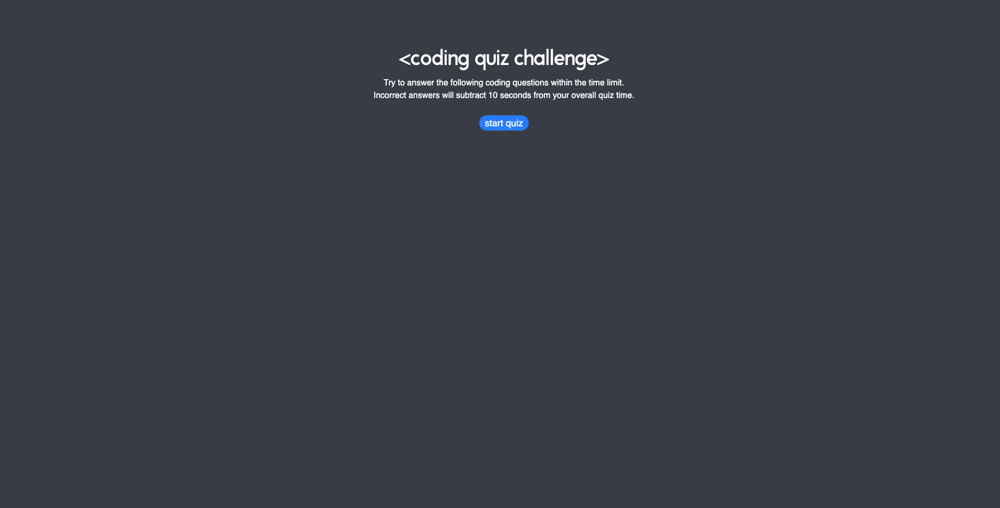
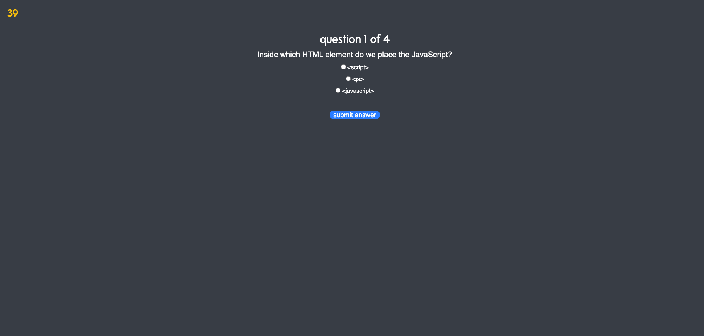
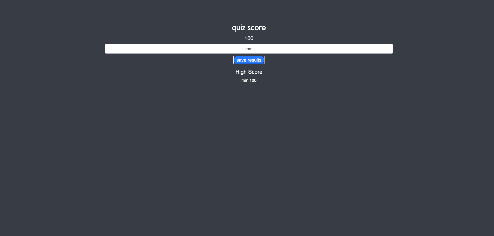

# code-quiz

## Project Description

This application was intended to help me become familiar with coding assessments and give me a chance to apply the skills that I have learned so far in my Coding Boot Camp at Denver University. I built a timed coding quiz that includes multiple-choice questions, a countdown timer that subtracts 10 seconds for incorrect answers, a quiz score, and a save results feature that displays the latest high score. This app runs in a browser and features dynamically updated HTML and CSS powered by JavaScript code.

## Challenges

This project presented a number of challenges that forced me to think outside of the box and seek additional assistance from a tutor and personal mentors. The two most challenging parts of this application were figuring out how to get the countdown timer to work on the initial click event to start the quiz and then how to properly utilize 'localStorage' in order to store the user's results and deciphor if their score is a high score or not. I don't think I would've been able to complete this application without the resources that I utilized, however, through this experience it seems as if resourcing is a very normal part of a web developers arsenal!

## Conclusion

This application really broadened my understanding of how to write functions as well as how to use 'localStorage' in a variety of different ways as I didn't quite understand how these areas of JS worked prior. I don't feel like I have mastered these things yet, but I am getting there!

## URL to deployed application

[Coding Quiz Challenge](https://mychalgm.github.io/code-quiz) 
[Repository](https://https://github.com/mychalgm/code-quiz)

## application screenshots

## resources

Study Group 
Personal Mentor 
Denver University Tutoring Services 
"JavaScript & jQuery: Interactive Front End Development" by Jon Duckett 
https://www.w3schools.com 
https://www.codemahal.com/video/javascript-quiz-tutorial
